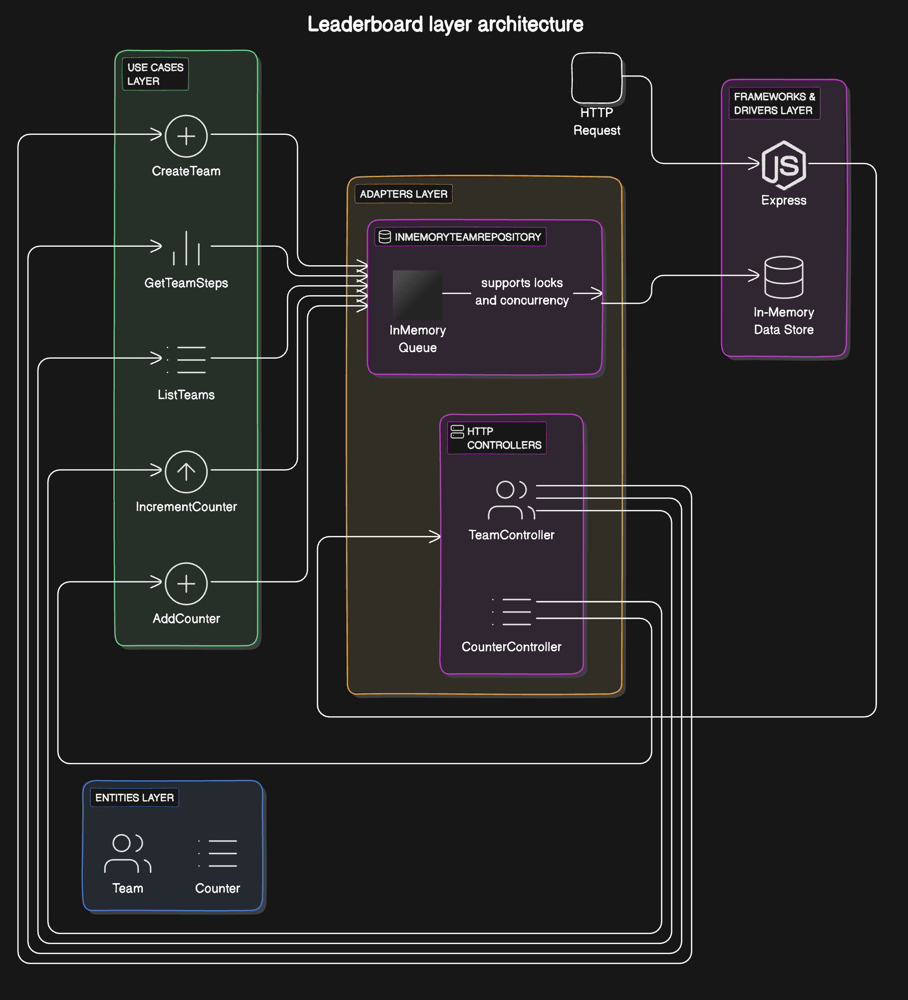

# **Steps Leaderboard Application**

This is a **Steps Leaderboard** application, where teams of employees accumulate steps. The application is built using **Node.js**, **TypeScript**, **MySQL**, and **Redis**. The architecture follows the **Clean Architecture** principles to separate concerns and make the application more maintainable, testable, and scalable.
MySQL and Redis are proposed as ideas for future scalability and performance improvements. While their potential use is acknowledged, they are not fully implemented in this version of the application.

To demonstrate craftsmanship and clean code principles, a conscious decision was made to implement the core logic from scratch, avoiding the use of libraries or frameworks for critical components. Even Dependency Injection (DI) has been manually implemented to ensure greater control and clarity in the design.

This version emphasizes the rationale behind the design decisions, focusing on craftsmanship and future scalability while making it clear that MySQL and Redis are not fully integrated at this stage.

If additional time is available, the next step would be to implement integration tests with concurrent requests to ensure that the application behaves as expected under real-world conditions (there is the reason why docker was added to the project).  I also use the TDD (Test-Driven Development) approach to make sure the code is well-tested and works properly for real projects.

I see that application requires a lot of improvements and enhancements to make it production ready. I would like to discuss these improvements in the next round of interview.

I have added [answers](./docs/questions.md) for the questions asked in the pdf.
---

## **Table of Contents**

- [Overview](#overview)
- [Architecture](#architecture)
    - [Entities](#entities)
    - [Use Cases](#use-cases)
    - [Adapters](#adapters)
    - [Frameworks & Drivers](#frameworks--drivers)
- [Getting Started](#getting-started)
    - [Prerequisites](#prerequisites)
    - [Installation](#installation)
    - [Running the Application](#running-the-application)
- [API Documentation](#api-documentation)
    - [Endpoints](#endpoints)
- [Environment Configuration](#environment-configuration)

---

## **Overview**

The Steps Leaderboard application is designed to track the steps taken by teams of employees. Each team consists of one or more employees, and each employee has a step counter. The application allows you to:

- Create new teams and step counters.
- Increment the step counters for each team member.
- Get the total steps accumulated by a team.
- View the leaderboard of all teams.
- Manage (add, delete) teams and counters.

The application is designed to support high concurrency using **Redis** for locking and **MySQL** for data persistence.

---

## **Architecture**

This project is built using **Clean Architecture**. Clean Architecture helps to separate the **business logic** from the **implementation details** (e.g., frameworks, databases, external services).

### **Key Components of the Architecture**:

1. **Entities**: The core business objects of the application (e.g., `Team`, `Counter`).
2. **Use Cases**: Application-specific business rules. These are the operations that can be performed on the entities.
3. **Adapters**: Interface layers between the external world and the core application logic (e.g., HTTP controllers, repositories).
4. **Frameworks & Drivers**: External systems like the web server, database, and third-party libraries (e.g., Express, MySQL, Redis).

### **Architecture Layers**


#### **Entities**
- **Team**: Represents a team, which has an `id`, `name`, and an array of `counters`.
- **Counter**: Represents an individual counter associated with a team member, which tracks the number of steps for that member.

#### **Use Cases**
- **CreateTeam**: Creates a new team.
- **AddCounter**: Adds a counter (step tracker) for a team member.
- **IncrementCounter**: Increments the steps for a specific team member's counter.
- **GetTeamSteps**: Retrieves the total steps accumulated by a team.
- **ListTeams**: Lists all teams and their total steps.
- **DeleteTeam**: Deletes a team and its associated counters.

#### **Adapters**
- **HTTP Controllers**: These controllers handle HTTP requests and route them to the appropriate use cases.
    - **TeamController**: Manages team-related requests (create, delete, list teams).
    - **CounterController**: Manages counter-related requests (add, increment, list counters).

- **Repositories**: These are responsible for data persistence.
    - **MySQLTeamRepository**: Implements the `TeamRepository` interface using MySQL.
    - **InMemoryTeamRepository**: A simple in-memory repository for testing purposes.

#### **Frameworks & Drivers**
- **Express**: A web framework used to handle incoming HTTP requests.
- **MySQL**: Used as the persistent data store for teams and counters.
- **Redis**: Used for distributed locking to handle concurrency issues.
- **TypeScript**: Used for static typing and code quality.
- **Docker**: Used to containerize the application and its dependencies.

---

## **Getting Started**

### **Prerequisites**

- **Node.js** (v20.10.0 or higher)
Following technologies added for the possible future enhancements:
- **MySQL** (v8 or higher) - for future persistent storage
- **Redis** (latest version) - for bullMq for future scalability
- **Docker** (if using Docker for development) - docker for easy deployment and scalability

### **Installation**

1. Clone the repository:

   ```bash
   git clone https://github.com/your-repo/steps-leaderboard.git
   cd steps-leaderboard
   ```

2. Install dependencies:

   ```bash
   yarn install
   ```

3. Set up the environment variables. Create a `.env` file based on the example:

   ```bash
   cp .env.example .env
   ```

4. Configure the database and Redis settings in `.env`.

### **Running the Application**

You can run the application either using **Docker** or locally using Node.js.

#### **Option 1: Using Docker**

1. Build and start the services:

   ```bash
   docker-compose up -d
   ```

2. MySQL will be automatically initialized with the schema.

#### **Option 2: Running Locally**

1. Make sure MySQL and Redis are running in case you are testing not node in-memory config.
2. Run the TypeScript compiler in watch mode and start the server with `nodemon`:

   ```bash
   yarn run dev
   ```

---

## **API Documentation**

The API follows RESTful principles and exposes the following endpoints:

### **Base URL**: `http://localhost:3000`

### **Endpoints**

| Method | Endpoint                               | Description                                            |
|--------|----------------------------------------|--------------------------------------------------------|
| `POST` | `/teams`                               | Create a new team                                      |
| `POST` | `/counters`                            | Add a new counter to a team                            |
| `POST` | `/increment`                           | Increment steps for a specific counter                 |
| `GET`  | `/teams/:teamId/steps`                 | Get the total steps for a specific team                |
| `GET`  | `/teams`                               | List all teams and their total steps                   |
| `GET`  | `/teams/:teamId/counters`              | List all counters (members) of a specific team         |
| `DELETE` | `/teams/:teamId`                     | Delete a team and its associated counters              |
| `DELETE` | `/teams/:teamId/counters/:counterId` | Delete a counter from a specific team                  |

### **Request and Response Examples**

#### **Create a New Team**

- **Request**:

  ```bash
  POST /teams
  Content-Type: application/json

  {
    "name": "Team Alpha"
  }
  ```

- **Response**:

  ```json
  {
    "id": "team-1",
    "name": "Team Alpha",
    "counters": []
  }
  ```

#### **Add a Counter**

- **Request**:

  ```bash
  POST /counters
  Content-Type: application/json

  {
    "teamId": "team-1",
    "memberName": "John Doe"
  }
  ```

- **Response**:

  ```json
  {
    "id": "counter-1",
    "teamId": "team-1",
    "memberName": "John Doe",
    "steps": 0
  }
  ```

#### **Increment Counter**

- **Request**:

  ```bash
  POST /increment
  Content-Type: application/json

  {
    "counterId": "counter-1",
    "teamId": "team-1",
    "steps": 500
  }
  ```

- **Response**:

  ```json
  {
    "id": "counter-1",
    "teamId": "team-1",
    "memberName": "John Doe",
    "steps": 500
  }
  ```

---

## **Environment Configuration**

The application requires several environment variables to be set. Below is an example of the `.env` file:

```bash
# Database configuration
DB_TYPE=mysql
MYSQL_HOST=localhost
MYSQL_USER=root
MYSQL_PASSWORD=examplePassword
MYSQL_DATABASE=steps_leaderboard

# Redis configuration
REDIS_HOST=localhost
REDIS_PORT=6379

# App settings
PORT=3000
```

### **Docker Configuration**

If you're using Docker, ensure the `docker-compose.yml` is configured to map the correct ports for MySQL and Redis.

---

## **Conclusion**

This project follows **Clean Architecture** to ensure separation of concerns, scalability, and ease of maintenance. The use of **TypeScript** provides type safety.